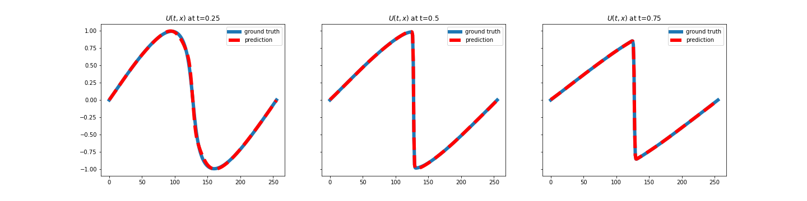

<h1 style="font-weight:bold" align="left">Physics Informed Neural Networks</h1>

This repository provides a PyTorch implementation of the physics informed neural networks by [M.Raissi et al.](https://www.sciencedirect.com/science/article/pii/S0021999118307125) The following exploration was performed to understand the data used to solve the Burgers' equation. The following plot shows the solution u(t,x) and the prediction.

<p style="center">

</p>

<h3 style="font-weight:bold">Experiment setup</h3>

1. Setup the environment

```bash
conda create --name PINN python=3.7.9
conda activate PINN

pip install requirements.txt
```

2. Run the experiment

```bash
cd src
python main.py --config_path ./config.json
```

<h3 style="font-weight:bold">References</h3>

-   Raissi, Maziar, Paris Perdikaris, and George E. Karniadakis. "[Physics-informed neural networks: A deep learning framework for solving forward and inverse problems involving nonlinear partial differential equations](https://www.sciencedirect.com/science/article/pii/S0021999118307125)." Journal of Computational Physics 378 (2019): 686-707.

-   Raissi, Maziar, Paris Perdikaris, and George Em Karniadakis. "[Physics Informed Deep Learning (Part I): Data-driven Solutions of Nonlinear Partial Differential Equations](https://arxiv.org/abs/1711.10561)." arXiv preprint arXiv:1711.10561 (2017).

-   Raissi, Maziar, Paris Perdikaris, and George Em Karniadakis. "[Physics Informed Deep Learning (Part II): Data-driven Discovery of Nonlinear Partial Differential Equations](https://arxiv.org/abs/1711.10566)." arXiv preprint arXiv:1711.10566 (2017).
